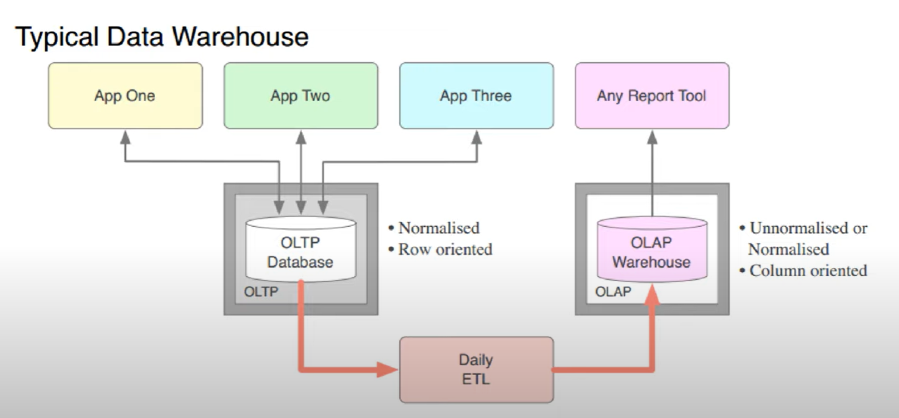

# analytics workloads

- analytical workloads is about transforming data into various insights 

## data processing solutions:

- **OLTP**
  - **online transaction processing solution**
  - for the day-to-day operations of a business where transactional data in database is processed. Data is usually normalized here (exaple duplicates removed, other data cleansing done) before being sent to DWH. 
  - These kinds of systems record transactions, which are small in discrete units of work that needs to be executed or rolled back as a whole, example deposit in bank account etc.
  - follow ACID rules, which stand for atomicity, consistency, isolation, and durability
  - often associated with relational databases, such as SQL Server, Oracle, DB2, and so on
  - optimized for CRUD transactions, create, read, update and delete

- **OLAP**
  - **online analytical processing**
  - Data from individual databases are kept in DWH in de-normalized state as data is from different sources so there usually there won't be any relationship between data. 
  - provide support for business intelligence or BI, which is a set of technologies, applications, and practices to support business decision-making.
  - analytical systems must be optimized for read operations.
  - example: data warehousing solutions such as SQL Server Analysis services or Azure Synapse Analytics.
  - Also we use Tableau/ BI or other analytical tools to get reports or do different analysis for data collected here. 

## Typical Data Warehouse:

- data is coming from multiple sources - app1, app2 etc. 
- this data is temporarily stored in database which is OLTP Database 
- So these applications are interacting with OLTP systems 
- This data is completely row oriented and  normalized data would be present.
- this data is dumped to DWH through ETL processing
- ETL is done on daily basis, weekly basis or monthly basis as per organizational requirement 
- once ETL is done, data is dumped into OLAP systems 
- This historical data is used for analytical purpose. 

## Data Modeling: 

- based on data processing solution OLTP or OLAP we decide how we will model out data
- **OLTP**:
  - works on normalized data
  - Normalization consist of distributing the data across several related tables to ensure data integrity and preventing data redundancy.
  - favours CRUD operaions
  
- **OLAP**: 
  - de-normalized model which decreases the number of table even if that incurs some data redundancy
  - because for analytics many tables need to be joined so de-normalized model is best suited

## Modeling Standard:

- popular schemas are star schema and snowflake schemas
- **Star Schema:**
  - main modeling standard for business intelligence solution
  
  - On a star schema, you have a central facts table in the middle  with data about something that happened, the sale of product, an ATM withdrawal, or the prescription for magical treatment.
  - Then you have dimension tables around fact table that describe what happened
  - one-to-end operations between facts and dimensions
  - In Fact Table every Column is primary key and corresponding column in the dimension is the foreign key. 

  - **What is Fact Table**
    - in Star schema we have one main table and every table is related to this main table.
    - this main table is called fact table.
  - example Start Schema: 

- **Snowflake Schema**
  - its extension of Star Schema
  - your dimensions are more normalized into multiple tables
  - These decreases data repetition, but makes your models more complex
  - example: 